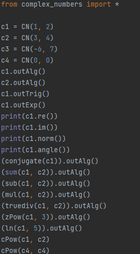
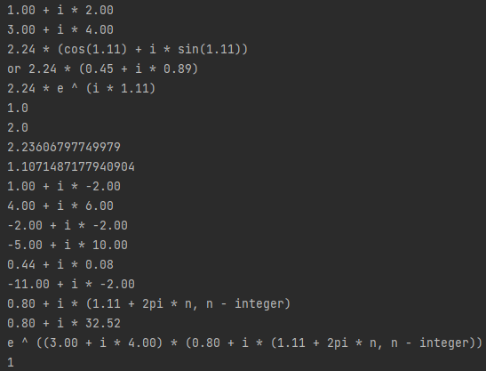
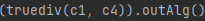
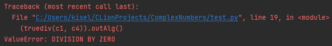
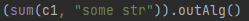
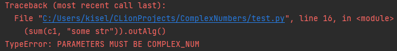
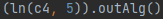
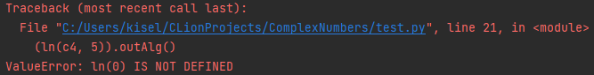

# ComplexNumbers
Python module for complex numbers operations. C implemented.
## To start
* run _python setup.py install_
* _from complex_numbers import *_
---
## List of functions
* **_CN(a, b)_** - creating complex number with real part _a_, imaginary part _b_;
* For example: **_c = CN(a, b);_** 
* **_c.re()_** - real part of complex number
* **_c.im()_** - imaginary part of complex number
* **_c.norm()_** - norm of complex number
* **_c.angle()_** - angle of complex number
* **_c.outAlg()_** - complex number output in algebraic form
* **_c.outTrig()_** - complex number output in trigonometric form
* **_c.outExp()_** - number output in exponential
* **_conjugate(param c)_** - conjugate of complex number
* **_sum(param c1, param c2)_** - sum of two complex numbers
* **_sub(param c1, param c2)_** - subtract of two complex numbers
* **_mul(param c1, param c2)_** - multiplication of two complex numbers
* **_truediv(param c1, param c2)_** - division c1 by c2 of two complex numbers
* **_zPow(param c, param n)_** - integer pow of complex number (n - ((integer & n > 0) or (c = CN(0, 0) & n = 0)))
* _**ln(param c, param n - integer)**_ - complex logarithm of complex number with choosing branch (n) of complex logarithm
* **_cPow(param c1, param c2)_** - printing complex pow of complex number \
params c, c1, c2 have CN type
---
## Examples of using

### _Output:_ 

### _Some errors:_
\

\

\

